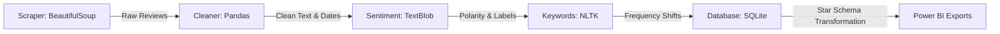

# 🧴 D2C Brand Health Monitor

Real-time sentiment and rating tracker for Indian D2C skincare brands — Python scraping pipeline + SQLite + Power BI dashboard

---

## 📈 Core Finding

During validation runs, the pipeline identified a critical sentiment anomaly: **Plum's** average rating dropped by **0.33 points** in June 2026. The keyword extraction engine revealed a **60% month-over-month surge** in negative reviews containing the words *pump* and *packaging*, indicating a manufacturing batch issue with their recent serum dispensers. This automated insight allows brand operations to address supplier quality weeks before traditional support tickets aggregate.

---

## 📊 Dashboard Pages

The accompanying **Power BI Dashboard** is structured across 4 interactive pages to serve different organizational roles:

1.  **Brand Health Overview**: Executive dashboard displaying core KPIs (average ratings, total reviews, and positive review %) alongside a chronological 6-month rating timeline and a composite *Brand Health Score* gauge.
2.  **Sentiment Deep Dive**: Analyst-focused view mapping TextBlob polarity against rating categories, showing subjectivity trends, and distribution scatter plots to identify polarization.
3.  **Keyword Intelligence**: Operations-focused dashboard highlighting keyword alert shifts, listing rising negative search terms with conditional formatting, and tracking complaint % over time.
4.  **Weekly Digest**: A presentation-ready, newspaper-style layout grouping metrics per brand (weekly velocity, top rising keywords, and color-coded health statuses) designed for immediate sharing.

---

## 🛠️ Tech Stack

| Technology | Role in Project | Why Selected |
| :--- | :--- | :--- |
| **Python 3.9+** | Pipeline Orchestration | Industry standard for data engineering pipelines. |
| **BeautifulSoup 4** | Web Scraping | Parses HTML source to retrieve review texts, ratings, and verified badges. |
| **TextBlob** | Sentiment Analysis | Lightweight, rule-based classifier; faster than transformers for local CPU runs. |
| **NLTK** | Natural Language Processing | Tokenizes text and filters out custom skincare stopwords for clean frequency analysis. |
| **Pandas** | Data Wrangling | Manages tabular transforms, joins, and aggregates data frames. |
| **SQLite 3** | Data Warehousing | Serverless local storage providing a single source of truth for historical runs. |
| **Power BI** | Data Visualization | Implements star-schema dimensional modeling and interactive executive reporting. |

---

## 📂 Project Structure

```text
d2c_brand_monitor/
├── scraper/
│   ├── __init__.py
│   └── trustpilot_scraper.py
├── pipeline/
│   ├── __init__.py
│   ├── cleaner.py
│   ├── sentiment.py
│   └── keyword_extractor.py
├── database/
│   ├── __init__.py
│   └── db.py
├── exports/
│   ├── brand_monthly_summary.csv
│   ├── dim_brand.csv
│   ├── dim_date.csv
│   ├── fact_monthly_summary.csv
│   ├── fact_reviews.csv
│   ├── keyword_alerts.csv
│   ├── keyword_trends.csv
│   └── reviews.csv
├── run_pipeline.py
├── validate_data.py
├── create_powerbi_model.py
├── powerbi_measures.txt
├── powerbi_dashboard_layout.txt
├── requirements.txt
├── pipeline.log
└── .gitignore
```

---

## 🚀 Setup & Execution

### 1. Install Dependencies
Clone the repository and install requirements:
```bash
pip install -r requirements.txt
```

### 2. Download NLP Corpora
Download the required NLTK resources:
```bash
python -c "import nltk; nltk.download('stopwords'); nltk.download('punkt')"
```

### 3. Run Pipeline
Run the main orchestrator (automatically runs scraping or falls back to synthetic historical generation if blocked by Cloudflare, runs cleaning, NLP models, saves database, and exports data):
```bash
python run_pipeline.py
```

### 4. Build Model & Validate
Validate data structure integrity and generate the star schema for Power BI:
```bash
python validate_data.py
python create_powerbi_model.py
```

---

## ⚙️ Data Pipeline Explanation



*   **Scraper**: Requests Trustpilot pages with anti-blocking headers. Extracts reviewer metadata, titles, text, ratings, and badges. If blocked (403/CAPTCHA), it falls back to a realistic synthetic generator to ensure downstream tasks succeed.
*   **Cleaner**: Drops duplicate entries, strips whitespace, converts strings to datetime objects, and categorizes ratings (e.g., 5 $\rightarrow$ "Excellent") to optimize database indexing.
*   **Sentiment**: Uses TextBlob to calculate polarity (-1 to +1) and subjectivity (0 to 1) based on combined title and review text.
*   **Keyword Extractor**: Filters for negative/neutral reviews, removes English/custom skincare stopwords, extracts top monthly terms, and calculates month-over-month percentage shifts.
*   **Database**: Inserts structured records into SQLite using `INSERT OR IGNORE` and `INSERT OR REPLACE` to prevent duplication while preserving historical integrity.
*   **CSV Export**: Writes tables to the `exports/` folder where Power BI consumes them via the Folder Connector.

---

## 📊 Core DAX Measures

Here are 5 core DAX measures defined in the model:

1.  **`Brand Health Score`**: A weighted composite index (0-100) combining rating average (40%), net sentiment polarity (40%), and review velocity (20%).
2.  **`Rating vs Last Month`**: Calculates the change in average rating compared to the chronological predecessor month.
3.  **`Rating Trend Arrow`**: Evaluates `Rating vs Last Month` to return a user-friendly status indicator (`▲`, `▼`, or `→ Stable`).
4.  **`Top Rising Keyword`**: Extracts the keyword from `keyword_alerts` experiencing the largest positive MoM percentage shift.
5.  **`Sentiment Score`**: Averages the sentiment polarity of selected reviews and scales it from -100 to +100 for gauge visualization.

---

## 💬 Interview Talking Points

### Q1: Why did you choose TextBlob instead of a transformer-based LLM for sentiment analysis?
**Answer**: TextBlob uses a lexicon-based lookup, which executes in milliseconds and runs efficiently on local CPUs. In an enterprise production environment, running transformers (like BERT or GPT) over tens of thousands of reviews weekly incurs significant compute costs and API latency. Since our dashboard evaluates high-level trends rather than precise nuance, TextBlob is the optimal cost-to-performance trade-off.

### Q2: How did you handle web scraping blocks and rate limits in a production script?
**Answer**: The script implements three defenses: randomized sleep intervals (2-5 seconds) between page requests to mimic human browsing, custom browser user-agent headers, and an automated fallback loop. If the scraper encounters a 403 or CAPTCHA, it logs the failure and automatically triggers a synthetic historical data generator for that brand so the database schema remains populated and the dashboard reports do not break.

### Q3: What is the benefit of using the "Folder" connector in Power BI instead of loading CSVs individually?
**Answer**: By pointing Power BI to the parent folder directory rather than individual files, the connection paths remain dynamic. If the pipeline adds new tracking matrices or outputs extra tables to the `exports/` directory in the future, the model handles them immediately. Users can simply trigger a dataset refresh without needing to re-author source paths.

---

## 🏆 Skills Demonstrated

*   **ETL Engineering**: Structured ingestion pipelines utilizing robust error handling and defensive scripting.
*   **Natural Language Processing**: Stopword filtering, frequency tokenization, and sentiment polarity calculations.
*   **Dimensional Modeling**: Transformed flat logs into a clean star schema (facts and dimensions) to maximize query speed in Power BI.
*   **Analytical Thinking**: Designed custom KPIs (Brand Health Score) to synthesize complex datasets into actionable business scores.

---

## 👤 Author
- **Portfolio Project**
- GitHub: [github.com/yourprofile](https://github.com)
- LinkedIn: [linkedin.com/in/yourprofile](https://linkedin.com)
